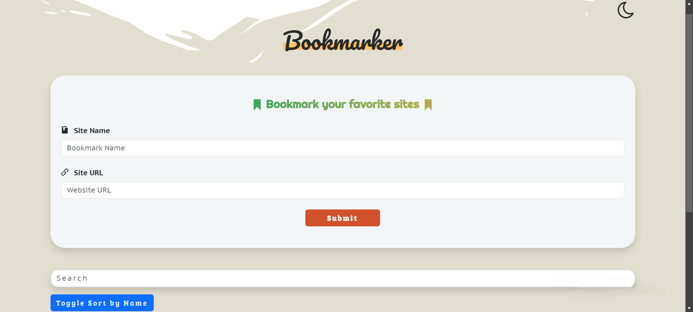
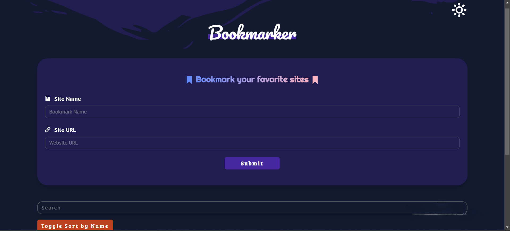

<div align="center">

# 🔖 Bookmarker - Your Ultimate Bookmarking Platform

<p>
  <table>
    <tr>
      <td></td>
      <td></td>
      <td></td>
    </tr>
    <tr>
      <td></td>
      <td></td>
      <td></td>
    </tr>
    <tr>
      <td></td>
      <td></td>
      <td></td>
    </tr>
  </table>
  <br>
  <b>Bookmarker</b>: منصة بسيطة وسهلة الاستخدام لتنظيم وتخزين الروابط المفضلة بسرعة وأمان. 🔗
  <br>

[Bookmarker Demo](https://omarrsakr.github.io/Bookmarker-APP/) •
[Documentation](https://github.com/OmarrSakr/Bookmarker-APP/wiki) •
[Report Issues](https://github.com/OmarrSakr/Bookmarker-APP/issues)

</p>
<br>

**`Bookmarker`** is a lightweight bookmarking platform built with core web technologies (**`HTML`**, **`CSS`**, **`JavaScript`**) to provide a seamless experience for organizing and accessing your favorite links. It allows users to **add**, **edit**, **delete**, and **search** bookmarks with a clean, intuitive interface, stored locally using **localStorage**.


</div>

<div align="center">

<p align="center">

## 📊 Project Stats

- 🔖 **Bookmarks**: Unlimited (stored in localStorage)  
- ⭐ **Average Rating**: 4.5/5 (based on user feedback)  
- 🌐 **Visitors**: 

</p>

---

## 🧑‍💻 Tech Stack

<p>
  
  
  
  
  
  
  
  
</p>

---

## 📷 Screenshots

<table>
  <tr>
    <td></td>
    <td></td>
  </tr>
</table>
</div>

---

## 📑 Table of Contents

- [🌐 Live Demo](#-live-demo)
- [🚀 Features](#-features)
- [🧑‍💻 Technologies Used](#-technologies-used)
- [📂 Project Structure](#-project-structure)
- [🔧 Installation](#-installation)
- [⚙️ Usage](#️-usage)
- [🛠️ Challenges & Solutions](#️-challenges--solutions)
- [📌 Future Improvements](#-future-improvements)
- [📢 Known Issues](#-known-issues)
- [🤝 Contributing](#-contributing)
- [📪 Feedback](#-feedback)
- [📜 License](#-license)

---

## 🌐 Live Demo

Check out the live demo of **Bookmarker** at 👉 [Bookmarker Demo](https://omarrsakr.github.io/Bookmarker-APP/)

---

## 🚀 Features

- 🔖 **Add Bookmarks**: Save website names and URLs with flexible input validation (accepts URLs with or without `https://`).
- 📋 **Bookmark Table**: Display all bookmarks with options to **visit**, **edit**, or **delete**.
- 🔎 **Search & Sort**: Filter bookmarks by name and sort in ascending/descending order.
- 📱 **Responsive Design**: Optimized for desktop and mobile devices using Bootstrap.
- 🌙 **Dark Mode Toggle**: Switch between light and dark themes, saved in localStorage.
- ⚠️ **Interactive Alerts**: Powered by SweetAlert2 for user-friendly pop-ups.
- ⚙️ **Real-Time Validation**: Instant feedback on input fields with Bootstrap validation styles.

---

## 🧑‍💻 Technologies Used

- **HTML5**: Structure and content.
- **CSS3**: Styling with responsive design and custom fonts (Pacifico, Righteous, PT Sans Caption, Bree Serif).
- **JavaScript (jQuery)**: Dynamic functionality and DOM manipulation.
- **Bootstrap (v5.3)**: Responsive grid system and UI components.
- **SweetAlert2 (v11)**: Custom alert pop-ups.
- **Font Awesome (v6.0)**: Icons for UI elements (e.g., back-to-top button).
- **IcoMoon**: Custom icons for bookmark and navigation elements.
- **LocalStorage**: Persistent bookmark storage.
- **VS Code + Live Server**: Development tools.

📦 **Dependencies**

- [jQuery](https://code.jquery.com/jquery-3.7.1.min.js)
- [Bootstrap](https://cdn.jsdelivr.net/npm/bootstrap@5.3.3/dist/js/bootstrap.bundle.min.js)
- [SweetAlert2](https://cdn.jsdelivr.net/npm/sweetalert2@11)
- [Font Awesome](https://cdnjs.cloudflare.com/ajax/libs/font-awesome/6.0.0-beta3/css/all.min.css)
- [IcoMoon](assets/fonts/icomoon/)

---

## 📂 Project Structure

```
Bookmarker-APP/
├── assets/
│ ├── CSS/
│ │ ├── bootstrap.min.css
│ │ ├── icomoon.css
│ │ ├── style.css
│ │ ├── sweetalert2.min.css
│ ├── fonts/
│ │ ├── icomoon/
│ │ │ ├── icomoon.eot
│ │ │ ├── icomoon.svg
│ │ │ ├── icomoon.ttf
│ │ │ ├── icomoon.woff
│ ├── Imgs/
│ │ ├── bookmark.ico
│ │ ├── edit-pencil.svg
│ ├── JS/
│ │ ├── bootstrap.bundle.min.js
│ │ ├── jquery-3.7.1.min.js
│ │ ├── jsconfig.json
│ │ ├── main.js
│ │ ├── sweetalert2.all.min.js
├── Bookmarker-1.png
├── Bookmarker-2.png
├── index.html
├── LICENSE.md
└── README.md

```

---

## 🔧 Installation

1- **Clone the repository**

```bash
git clone https://github.com/OmarrSakr/Bookmarker-APP.git
```

2- **Navigate to the project directory:**

```bash
cd Bookmarker-APP
```

3- Open `index.html` in a modern browser or use a local server (e.g., VS Code Live Server) at `http://127.0.0.1:5500`.

---

## 📋 Requirements

- Modern browser (Chrome, Firefox, Edge).
- Internet connection for CDN libraries (Font Awesome; others are local).

---

## ⚙️ Usage

- 🔖 **Add Bookmarks**: Enter a name (min. 3 characters) and URL (e.g., `icomoon.io` or `https://example.com`) in the form.
- 📋 **Manage Bookmarks**: Use the table to visit, edit, or delete bookmarks.
- 🔎 **Search & Sort**: Use the search bar to filter bookmarks or the sort button to toggle name order.
- 🌙 **Toggle Theme**: Click the theme button to switch between light and dark modes.

---

## 🛠️ Challenges & Solutions

- **URL Validation Issue**

  - **Issue**: URLs without `https://` (e.g., `icomoon.io`) triggered validation errors, and error messages appeared despite successful saves.
  - **Solution**: Updated `UrlValidation` regex to accept URLs without protocols and auto-add `https://` on save. Added $`("#submitBtn").off("click").on("click", ...)` to prevent duplicate event handlers.

- **Responsive Table Display**

  - **Issue**: Table layout was not mobile-friendly.
  - **Solution**: Used Bootstrap’s responsive table classes (`table-responsive`) and custom CSS in `style.css`.

- **LocalStorage Persistence**

  - **Issue**: Bookmarks needed to persist across sessions.
  - **Solution**: Implemented `setLocalstorage` and `renderBookmarks` to manage data in `localStorage`.

- **Icon Compatibility**

  - **Issue**: Mixed use of Font Awesome and IcoMoon icons caused inconsistencies.
  - **Solution**: Ensured Font Awesome CDN and IcoMoon local fonts are properly loaded in `index.html` and `style.css`.


---

## 📌 Future Improvements

- 🗂️ **Categorize Bookmarks**: Add categories (e.g., Work, Education, Entertainment) for better organization.
- ☁️ **Cloud Sync**: Enable bookmark syncing via user accounts (e.g., Google, GitHub).
- ⏰ **Reminders**: Add notifications for revisiting important bookmarks.
- 🎨 **UI Enhancements**: Add animations and a card-based layout for mobile users.  
- 📤 **Export/Import**: Allow users to export bookmarks as JSON/CSV or import from files.
- 📊 **Analytics**: Track frequently visited bookmarks for user insights. 
- 🔒 **Data Security**: Encrypt bookmark data in `localStorage` using crypto-js.

---

## 📢 Known Issues

- ⚠️ **URL Validation**: Some complex URLs (e.g., with unconventional TLDs) may require further regex tweaks.
- ⚠️ **Mobile Table Display**: Table layout could be improved with a card-based view for mobile users (planned).

---

## 🤝 Contributing

We welcome contributions! To contribute:

1- **Fork** the repository  
2- **Create a new branch**

```bash
git checkout -b feature/your-feature-name  
```

3- **Commit changes:**

```bash
git add .
git commit -m "Add: short description of the feature" 
```

4- **Push to the branch:**

```bash
git push origin feature/your-feature-name    
```

5- Submit a Pull Request.

Please follow the Code of Conduct and discuss changes via issues.

---

## 📪 Feedback

💡 Encounter **bugs** or have **suggestions**?  
Please use the **GitHub issue tracker** or contact:  
<a href="https://mail.google.com/mail/?view=cm&fs=1&to=DevOmarHussien@gmail.com" target="_blank">
  
</a>


---

## 📜 License

Licensed under the **MIT License**.  
See the [LICENSE](./LICENSE.md) file for details.

---

<div align="center">

**⭐ If you found this project helpful, please give it a star! ⭐**

*Built with ❤️ for the community*

</div>
